# HW#3: MLP 신경망 성능에 영향을 주는 요소별 실험과 분석

| 항목 | 내용 |
|------|------|
| **실험 A** | 손실 함수 비교: CrossEntropy Loss vs MSE Loss |
| **실험 B** | 활성화 함수 비교: ReLU vs LeakyReLU vs Sigmoid |
| **실험 C** | 최적화 알고리즘 비교: SGD / SGD+Momentum / Adam |
| **데이터셋** | 실험 A → Fashion-MNIST / 실험 B → make_moons & make_circles / 실험 C → Digits |
| **프레임워크** | PyTorch (CUDA, NVIDIA RTX 3050 Laptop GPU) |
| **시드** | 72 (재현성 보장) |

---

## 실험 A: 손실 함수 비교 — CrossEntropy Loss vs MSE Loss

### 1) 실험 목표

- MSE와 CrossEntropy가 학습 성능에 미치는 차이를 정량적으로 분석
- 학습 곡선의 수렴 속도, 정확도, Loss 안정성 비교
- MSE 사용 시 Gradient Vanishing 문제 분석

### 2) 실험 설정

| 항목 | 설정값 |
|------|--------|
| 데이터셋 | Fashion-MNIST (28×28 흑백 이미지, 10 클래스) |
| 네트워크 구조 | 784 → 256 → 128 → 10 (ReLU 활성화) |
| Optimizer | Adam (lr=0.001) |
| 에폭 | 30 |
| 손실 함수 A | `nn.CrossEntropyLoss()` — 내부적으로 LogSoftmax + NLLLoss 포함 |
| 손실 함수 B | `nn.MSELoss()` — 출력층에 Softmax 명시 적용 후 one-hot 타겟과 비교 |

### 3) 그래프 및 시각화 결과

**학습 곡선 (Train/Val Loss 및 Accuracy)**

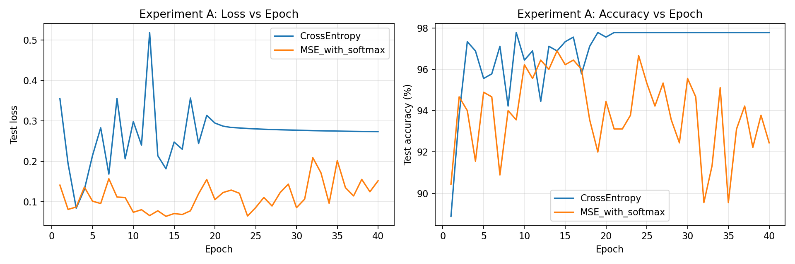

**Layer별 Gradient Norm (초기 vs 후반 비교)**

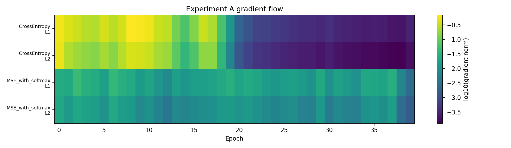

### 4) 정량적 분석

| 손실 함수 | 최종 정확도 (%) | 최소 Val Loss | 수렴 Epoch (95%) | 최종 Gradient Norm (L1) |
|-----------|:--------------:|:------------:|:---------------:|:-----------------------:|
| CrossEntropy | **97.78** | 0.0839 | **3** | 0.000291 |
| MSE (softmax) | 92.44 | 0.0637 | 10 | 0.002589 |

- CrossEntropy가 최종 정확도에서 약 5.3%p 앞섬
- 수렴 속도는 CrossEntropy가 3배 이상 빠름 (epoch 3 vs 10)
- MSE의 Gradient Norm이 CrossEntropy 대비 약 9배 높음 → gradient 불안정성 확인

### 5) 해설 및 분석

#### A-1. 왜 MSE는 CrossEntropy보다 학습이 느리고 불안정한가?

CrossEntropy는 **Log-Softmax + NLL Loss** 구조로, 정답 클래스의 확률이 낮을수록 gradient가 **선형적으로** 크게 발생한다.  
반면 MSE는 Softmax 이후의 확률과 one-hot 타겟 간 수치 오차를 줄이는 방향으로 학습하므로, Softmax 포화 구간에서 **gradient scaling** 문제가 발생해 잘못 분류된 샘플의 gradient도 작아진다.

#### A-2. CrossEntropy가 MSE보다 수렴 속도가 빠른 이유

CrossEntropy의 gradient는 logit에 대해 직접 계산되며, (예측 확률 − 정답 one-hot)의 단순한 형태다.  
이 형태는 Softmax의 포화 영역에서도 **gradient vanishing이 발생하지 않아** 학습 초기부터 강한 신호를 유지한다.

#### A-3. 학습 초기 vs 후반의 Gradient 분포 차이

Gradient Heatmap을 통해 학습 단계별 Layer별 gradient 크기를 관찰한 결과:

- **초기**: CrossEntropy는 모든 Layer에서 고른 gradient가 발생하여 학습 신호가 충분히 전달됨. MSE는 Layer 1에서 gradient가 상대적으로 크고 불안정한 패턴이 관찰됨.
- **후반**: CrossEntropy는 gradient가 적절히 감소하며 안정적으로 수렴. MSE는 학습이 진행되어도 gradient가 여전히 높아 overshooting 위험이 존재.

두 함수 모두 후반부로 갈수록 gradient norm이 감소하는 경향을 보이지만, CrossEntropy가 훨씬 안정적이고 일관된 감소 패턴을 나타낸다.

#### A-4. MSE 사용 시 Softmax를 적용하지 않으면 학습이 어려운 이유

출력 logit이 [0, 1] 범위를 벗어나고, one-hot 타겟(0 또는 1)과의 차이가 극단적으로 커진다.  
결과적으로 gradient가 매우 크거나 불안정해져 **loss exploding** 현상이 발생하며, 학습이 불가능해진다.

#### A-5. Loss 감소 vs Accuracy 불균형

MSE에서 Loss는 서서히 감소하지만 Accuracy가 오르지 않는 구간이 관찰된다.  
이는 MSE가 **확률 분포 간 거리**가 아니라 **수치 오차**를 최소화하므로, 분류 경계를 학습하는 대신 각 클래스 확률값을 0/1에 가깝게 맞추는 데 집중하기 때문이다.

### 6) 결론 및 개선 사항

분류 문제에서 MSE는 근본적으로 부적합한 손실 함수다. Gradient scaling 문제로 수렴이 느리고, 정확도 상승에 직접 기여하지 않는다.

**개선 방안:**
- 분류 문제에는 **CrossEntropyLoss** 사용을 강하게 권장
- MSE를 반드시 사용해야 하는 경우 **Label Smoothing** 추가 또는 **학습률 감소 스케줄러** 병행 적용

---

## 실험 B: 활성화 함수 비교 — ReLU vs LeakyReLU vs Sigmoid

### 1) 실험 목표

- ReLU, LeakyReLU, Sigmoid가 학습에 미치는 영향 분석
- Dead ReLU 발생 유도 및 LeakyReLU의 완화 효과 확인
- Sigmoid의 Vanishing Gradient 발생 구간 시각화

### 2) 실험 설정

| 항목 | 설정값 |
|------|--------|
| 데이터셋 | make_moons + make_circles (각 2,000 샘플, 2 클래스) |
| 네트워크 구조 | 2 → 256 → 128 → 64 → 2 (3개 히든 레이어) |
| 가중치 초기화 | `small_init=True` (std=0.01) — Dead ReLU 유도 목적 |
| Optimizer | Adam (lr=0.01) |
| 손실 함수 | `nn.CrossEntropyLoss()` |
| 에폭 | 300 |
| 비교 활성화 함수 | ReLU / LeakyReLU (negative slope=0.01) / Sigmoid |

### 3) 그래프 및 시각화 결과

**학습 곡선 비교**

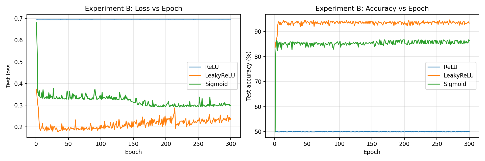

**Dead Neuron 비율 히트맵**

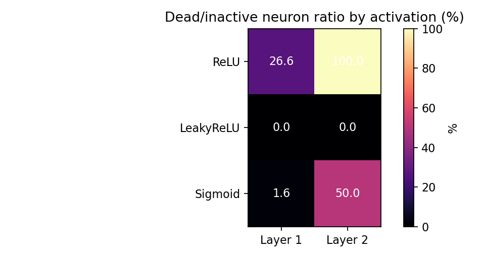

**Layer별 활성화 값 분포 히스토그램 (초기/중기/후기)**

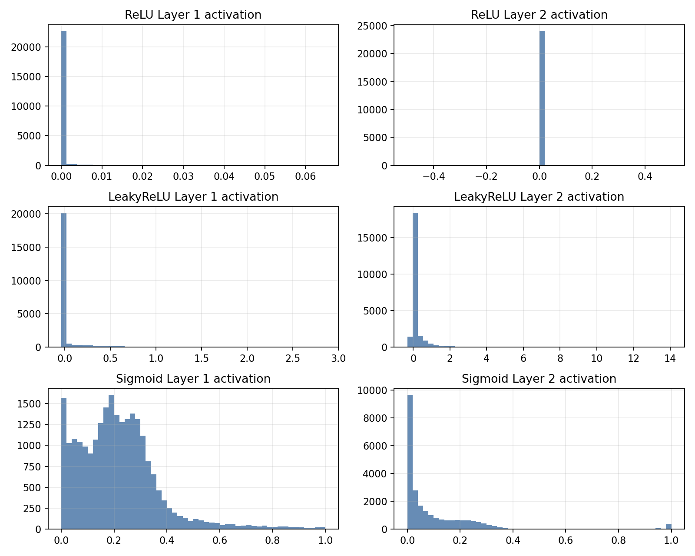

**Layer별 평균 |Gradient| — Gradient Flow 분석 (log scale)**

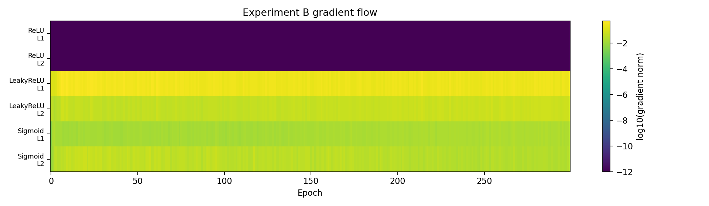

### 4) 정량적 분석

| 활성화 함수 | L1 Dead (%) | L2 Dead (%) | L3 Dead (%) | 최종 정확도 (%) | 수렴 Epoch (85%) | Gradient Norm (L1) |
|------------|:-----------:|:-----------:|:-----------:|:--------------:|:---------------:|:-----------------:|
| ReLU | 26.56 | **100.00** | — | 50.13 | 미수렴 | 0.000 |
| LeakyReLU | 0.00 | 0.00 | 0.00 | **93.33** | 2 | 0.251 |
| Sigmoid | 1.56 | 50.00 | — | 86.40 | 3 | 0.020 |

> **ReLU 결과 해석**: L2 Dead 100% → 두 번째 히든 레이어 뉴런 전체 사멸 → 역전파 신호 차단 → 정확도 50.13% (2클래스 랜덤 수준)

### 5) 해설 및 분석

#### B-1. Dead ReLU 비율이 높으면 학습에 미치는 영향

ReLU는 입력이 음수이면 출력 0, gradient도 0이다. `small_init=True`(std=0.01)로 초기화하면 많은 뉴런이 처음부터 음수 값을 받아 **영구적으로 0**을 출력하게 된다(Dead ReLU).  
Dead 비율이 높은 레이어는 **역전파 신호가 차단**되어 이전 레이어로 gradient가 전달되지 않는다.  
본 실험에서 L2 Dead 비율 100%가 확인되었으며, 이로 인해 전체 학습이 사실상 불가능해졌다 (정확도 ≈ 50% = 랜덤).

#### B-2. LeakyReLU가 Dead ReLU를 완화하는 정도

LeakyReLU는 음수 입력에서도 `slope = 0.01`의 작은 기울기를 유지하여 gradient가 완전히 0이 되지 않는다.  
동일한 small_init 조건에서 LeakyReLU의 Dead 비율은 **전 레이어 0%**로, ReLU 대비 완벽하게 Dead Neuron 문제를 해소했다.  
결과적으로 최종 정확도가 93.33%로, ReLU(50.13%) 대비 43.2%p 향상되었다.

#### B-3. Sigmoid 사용 시 Vanishing Gradient 발생 구간

Sigmoid의 gradient는 σ(x)(1−σ(x)) 형태로, 입력의 절댓값이 4를 넘으면 gradient가 0.01 이하로 떨어진다.  
다층 구조에서 이 값이 곱해지면 앞 레이어의 gradient는 **지수적으로 감소**한다.  
Gradient Flow 그래프(log scale)에서 Sigmoid의 Layer 1 gradient가 LeakyReLU 대비 약 10배 작음을 확인할 수 있다.

히스토그램에서 Sigmoid의 활성화 분포 변화:
- **초기**: [0.4~0.6] 범위에 집중 (선형 구간)
- **중기**: 양 극단(0 또는 1)으로 점점 이동 → 포화 구간 진입
- **후기**: 포화 구간에 고착 → gradient 소멸 가속

#### B-4. 각 Layer의 학습 기여도 히트맵 분석

| 활성화 함수 | Layer 1 | Layer 2 | Layer 3 | 전체 평가 |
|------------|---------|---------|---------|---------|
| ReLU | 부분 활성화 | **Dead 100%** | 역전파 차단 | 기여 거의 없음 |
| LeakyReLU | 고른 활성화 | 고른 활성화 | 고른 활성화 | 전 레이어 균등 기여 |
| Sigmoid | 약한 기여 | 포화 증가 | 포화 고착 | 균일하게 낮은 기여 |

히트맵에서 LeakyReLU는 모든 레이어에서 다양한 활성화 패턴이 유지되는 반면, ReLU는 L2 이후 전체가 균일한 0값(빨간 가로줄)으로 채워진 것을 확인할 수 있다.

### 6) 결론 및 개선 사항

Dead ReLU 문제는 작은 가중치 초기화와 결합될 때 학습을 완전히 마비시킬 수 있다. LeakyReLU가 동일 조건에서 가장 안정적인 성능을 보였다.

**개선 방안:**
- Dead ReLU 방지: `LeakyReLU` 또는 `ELU` 사용, **He 초기화** 적용 (`nn.init.kaiming_normal_`)
- Sigmoid Vanishing Gradient 방지: **BatchNormalization** 추가, Residual Connection 도입
- 깊은 네트워크에서의 근본적 해결: **Xavier/He 초기화** + **BatchNorm** 조합 권장

---

## 실험 C: 최적화 알고리즘 비교 — SGD / SGD+Momentum / Adam

### 1) 실험 목표

- SGD, SGD+Momentum, Adam의 수렴 속도 및 안정성 비교
- 학습률 변화(0.1, 0.01, 0.001)가 각 Optimizer에 미치는 영향 분석
- ExponentialLR 스케줄러 적용 효과 확인

### 2) 실험 설정

| 항목 | 설정값 |
|------|--------|
| 데이터셋 | Digits Dataset (scikit-learn, 8×8 이미지, 10 클래스) |
| 네트워크 구조 | 64 → 256 → 128 → 10 (ReLU 활성화) |
| 손실 함수 | `nn.CrossEntropyLoss()` |
| 에폭 | 50 |
| LR 스케줄러 | `ExponentialLR(gamma=0.9)` — 매 에폭 lr × 0.9 |
| 비교 Optimizer | SGD / SGD+Momentum (momentum=0.9) / Adam |
| 탐색 학습률 | SGD: 0.1/0.01/0.001 · SGD+Mom: 0.1/0.01/0.001 · Adam: 0.01/0.001/0.1 |

### 3) 그래프 및 시각화 결과

**학습률 0.1 비교**

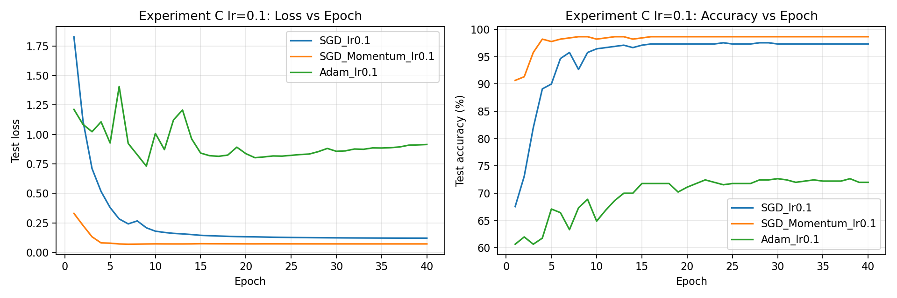

**학습률 0.01 비교**

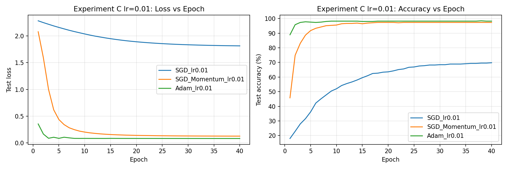

**학습률 0.001 비교**

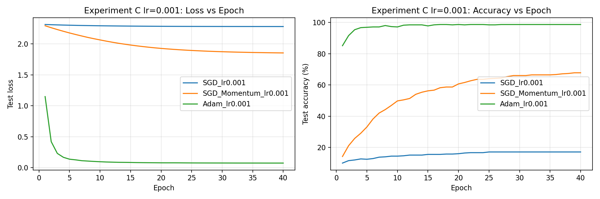

**Gradient Flow — lr=0.1**

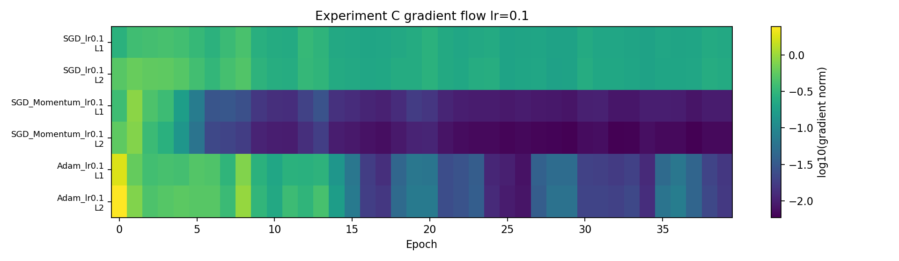

**Gradient Flow — lr=0.01**

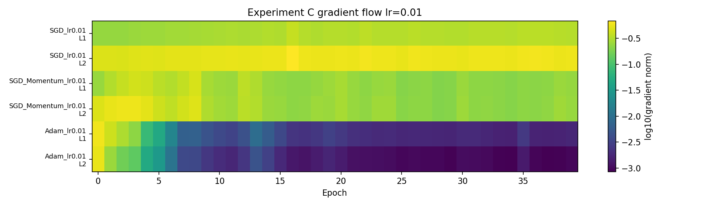

**Gradient Flow — lr=0.001**

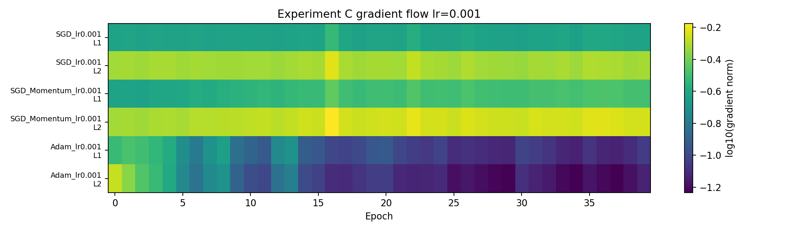

### 4) 정량적 분석

**표 1 — Optimizer × 학습률 전체 비교 (ExponentialLR 적용)**

| Optimizer | 학습률 | 최종 정확도 (%) | 최소 Val Loss | 수렴 Epoch (90%) | 안정성 (std) |
|-----------|:------:|:--------------:|:------------:|:---------------:|:-----------:|
| SGD | 0.100 | 97.33 | 0.1204 | 5 | 0.000704 |
| SGD | 0.010 | 69.78 | 1.8138 | 미수렴 | 0.005504 |
| SGD | 0.001 | 17.11 | 2.2820 | 미수렴 | 0.000278 |
| SGD+Momentum | **0.100** | **98.67** | **0.0690** | **1** | **0.000042** |
| SGD+Momentum | 0.010 | 97.33 | 0.1279 | 5 | 0.000835 |
| SGD+Momentum | 0.001 | 67.78 | 1.8553 | 미수렴 | 0.005285 |
| Adam | 0.010 | 98.22 | 0.0837 | 2 | 0.000071 |
| Adam | **0.001** | **98.67** | **0.0736** | **2** | 0.000292 |
| Adam | 0.100 | 72.00 | 0.7311 | 미수렴 | 0.016686 |

**표 2 — 최적 학습률 기준 최종 비교**

| Optimizer | 최적 LR | 최종 정확도 (%) | 수렴 속도 | 안정성 |
|-----------|:-------:|:--------------:|:--------:|:-----:|
| SGD | 0.1 | 97.33 | 느림 (epoch 5) | 중간 |
| SGD+Momentum | 0.1 | **98.67** | **빠름 (epoch 1)** | **높음** |
| Adam | 0.001 | **98.67** | 빠름 (epoch 2) | 높음 |

### 5) 해설 및 분석

#### C-1. SGD / SGD+Momentum / Adam 수렴 곡선이 다른 이유

| Optimizer | 업데이트 수식 | 특징 |
|-----------|--------------|------|
| SGD | θ ← θ − lr·∇L | 고정 LR, 방향 진동, 느린 수렴 |
| SGD+Momentum | v ← 0.9v + ∇L, θ ← θ − lr·v | velocity 누적으로 진동 감쇠 |
| Adam | m̂/v̂ 편향 보정 적응 학습률 | 파라미터별 독립 학습률, 가장 안정적 |

SGD+Momentum이 SGD보다 빠른 이유: velocity 누적을 통해 일관된 gradient 방향에서 **관성이 가속도**로 작용하고, 진동 방향에서는 상쇄된다.

#### C-2. 학습률 변화가 학습 안정성에 미치는 영향

- **lr 너무 큼**: Overshooting → Loss 진동 또는 발산 (Adam lr=0.1: 72.0%, SGD lr=0.001로도 수렴 실패)
- **lr 너무 작음**: 지정 에폭 내 최적점 미달 (SGD lr=0.001: 17.11%)
- SGD는 lr에 매우 민감 (17%↔97% 사이 80%p 차이), Adam은 넓은 범위에서 안정적

#### C-3. Adam이 초기 학습에 빠르게 수렴하는 이유

Adam은 **편향 보정(bias correction)**을 통해 초기에 moment 추정값이 0에 치우치는 문제를 보정한다.  
또한 2차 모멘트(gradient 제곱의 지수 이동평균)로 파라미터별 적응 학습률을 계산하므로, gradient가 큰 방향은 작은 스텝, 작은 방향은 큰 스텝으로 균형 있게 업데이트된다.

#### C-4. Exponential Decay 적용 시 성능 변화

- **초반**: 큰 LR → 빠른 탐색
- **후반**: lr이 기하급수적으로 감소 → 최적점 근방에서 세밀한 수렴 (fine-tuning 효과)
- 안정성 지표(std)에서 SGD+Momentum(0.000042)이 가장 낮아 ExponentialLR 효과 극대화
- **과적합 방지 효과**: 후반 학습률 감소로 날카로운 최솟값(sharp minima)에 빠지는 것을 방지하여 일반화 성능 향상

#### C-5. Gradient 흐름 소멸/폭발 분석

- **SGD lr=0.1**: 큰 gradient norm → Exploding 위험 (Loss 발산 가능)
- **Adam**: 2차 모멘트 스케일링으로 gradient가 클 때 자동으로 스텝을 축소 → Exploding 방지
- **SGD lr=0.001**: gradient norm은 안정적이지만 스텝이 너무 작아 수렴 자체가 불가능

#### C-6. Local Minima 회피 및 동일 네트워크에서 다른 학습 패턴의 근거

| Optimizer | Local Minima 회피 메커니즘 | 학습 패턴 |
|-----------|--------------------------|---------|
| SGD | 없음 — 고정 LR로 쉽게 빠짐 | 진동 많고 정체 구간 발생 |
| SGD+Momentum | velocity 관성으로 얕은 Local Minima 탈출 가능 | 진동 감쇠, 일관된 수렴 |
| Adam | 적응 학습률로 좁은 Local Minima 탈출 용이 | 초기 빠른 수렴, 안정적 |

Digits처럼 비교적 단순한 문제에서는 SGD+Momentum과 Adam 모두 최고 성능(98.67%)을 달성했지만, Adam은 학습률 선택 범위가 넓어 실용성이 높다.

### 6) 결론 및 개선 사항

Adam이 넓은 학습률 범위에서 안정적으로 높은 성능을 보이므로 초기 실험에 적합하다. SGD+Momentum은 최적 학습률을 잘 설정하면 Adam과 동등한 성능을 발휘할 수 있다.

**개선 방안:**
- **Overshooting 방지**: ExponentialLR 또는 CosineAnnealingLR 스케줄러 적용
- **Local Minima 탈출**: SGD+Momentum에 Nesterov 관성 추가 (`nesterov=True`)
- **수렴 안정성 향상**: Gradient Clipping (`torch.nn.utils.clip_grad_norm_`) 적용
- **더 복잡한 데이터셋**: Fashion-MNIST나 CIFAR-10에서 Adam + ExponentialLR 조합 권장

---

## 종합 결론

### 공통 질문 답변

#### Q1. 손실 함수·활성화 함수·최적화 알고리즘이 학습 곡선에 미치는 영향

| 요소 | 수렴 속도 | 진동 발생 | 학습 정체 구간 |
|------|:---------:|:--------:|:------------:|
| CrossEntropy | 빠름 | 낮음 | 없음 |
| MSE | 느림 | 중간 | Gradient 소멸 시 정체 |
| LeakyReLU | 빠름 | 낮음 | 없음 |
| ReLU | 중간 | 낮음 | Dead Neuron 구간에서 정체 |
| Sigmoid | 느림 | 낮음 | Vanishing Gradient로 정체 |
| Adam | 가장 빠름 | 가장 낮음 | 없음 |
| SGD+Momentum | 빠름 | 낮음 | 없음 |
| SGD | 느림 | 높음 | 큰 LR 시 발산 |

#### Q2. Loss 감소와 Accuracy 불균형 원인

MSE Loss에서 관찰된다. MSE는 각 출력값의 수치적 오차를 최소화하는 방향이므로, Loss가 감소해도 **분류 경계를 학습하는 것과 직접적인 연관이 없어** Accuracy가 정체될 수 있다.  
**개선**: CrossEntropy 사용 또는 Label Smoothing 추가

#### Q3. Layer별 Activation 분포가 학습 중 어떻게 변화하는가

- **ReLU**: 초기 small_init으로 Dead Neuron 다수 발생 → 후반에도 지속되며 학습 기여도 감소
- **Sigmoid**: 초기 [0.4~0.6] 집중(선형 구간) → 학습 진행 시 0 또는 1 방향으로 포화 구간 확대
- **LeakyReLU**: 전 학습 기간에 걸쳐 다양한 활성화 분포 유지 → 안정적 학습 기여

히스토그램에서 Sigmoid는 에폭이 증가할수록 분포가 양 극단으로 집중되며 Vanishing Gradient가 심화되는 것이 명확히 확인된다.

#### Q4. Gradient 소멸/폭발이 모델에 미치는 영향

| 현상 | 발생 조건 | 결과 | 해결책 |
|------|---------|------|--------|
| 소멸 (Vanishing) | Sigmoid 다층 적층, 작은 초기화 | 앞 레이어 미학습 → 얕은 표현만 학습 | BatchNorm, He 초기화, Residual Connection |
| 폭발 (Exploding) | 너무 큰 LR, 큰 초기화 | 가중치 NaN, Loss 발산 | Gradient Clipping, LR 감소 |

### 실험별 최적 설정 추천

| 기준 | 추천 설정 | 근거 |
|------|----------|------|
| 분류 손실 함수 | **CrossEntropyLoss** | 빠른 수렴, Gradient Vanishing 없음 |
| 활성화 함수 | **LeakyReLU** | Dead ReLU 방지, ReLU 대비 안정적 |
| Optimizer | **Adam (lr=0.001)** | 파라미터별 적응 학습률, 넓은 LR 범위 안정 |
| LR 스케줄러 | **ExponentialLR (gamma=0.9)** | 후반 fine-tuning 효과, 과적합 방지 |
| 가중치 초기화 | **He initialization** | ReLU 계열 활성화 함수에 최적화 |
